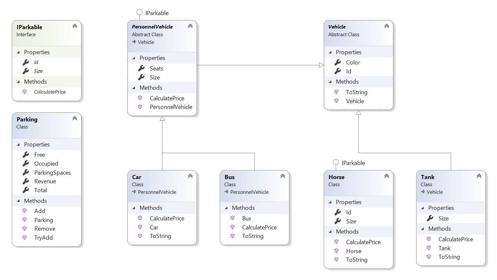
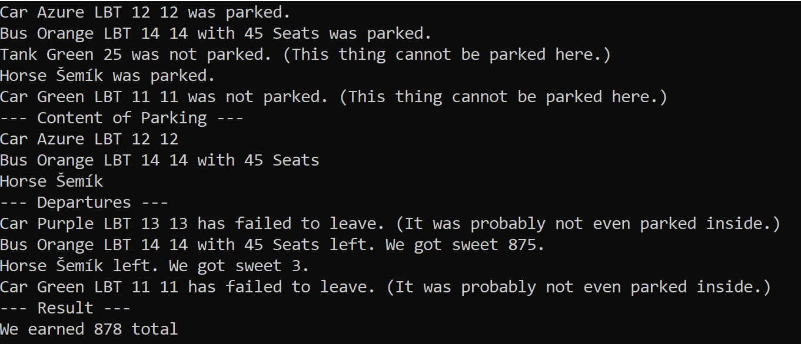

# projekt Parkoviště
Naše škola se rozhodla postavit si veřejné parkoviště. Naprogramujte třídy modelující proces placení parkovného.
Navrhněte třídy a interface podle diagramu. Vhodně pracujte s dědičností, polymorfismem a dalšími mechanismy OOP.

## Diagram aplikace

### Vehicle
Barvu můžete řešit jako typ `System.Drawing.Color`
### IParkable
* `Id` slouží jen pro unikátní identifikaci dopravního prostředku (SPZ např.)
* `Size` určuje kolik kolik parkovacích "slotů" věc potřebuje (např. auto asi méně, než autobus)
* `CalculatePrice(int HoursSpent)` určí cenu parkovného v závislosti na počtu strávených hodin
### Car
Je základní dopravní prostředek s "nejmenším" nárokem na prostor v parkovišti
### Horse
Není větší než `Car`
### Bus
Je 5× větší než osobní automobil (`Car`)
### Tank
Neimplementuje IParkable a je tu hlavně proto, abychom mohli ověřit, že OOP funguje a že jste jej správně pochopili ;-)
Zabírá celkem 2× více prostoru, `Car`

## Výpočet ceny parkovného
Jak se počítá cena parkovného pro všechny, kterým se podaří zaparkovat:
* Horse platí 1 Kč za hodinu.
* PersonnelVehicle platí `size * hoursSpent * seats`
* Car platí 15 * hoursSpent.
* Bus platí 200 + to, co by platil PersonnelVehicle.
* Tank platí vždy 10000 Kč.

## Třída Parking
Třída Parking obsahuje prostředky pro uchovávání informací o zaparkovaných (ne)vozidlech. 
Třída umí přidávat do své vnitřní kolekce nové prostředky implementující rozhraní `IParkable` přes metodu `Add(IParkable)`.
Dále se umí pokusit o přidání jiných věcí metodou `TryAdd(object)`, pokud se přidání věcí nepodaří, nic se nestane a metoda vrací `false`.
Třída ještě umí prostředek vyřadit ze své kolekce přes `public bool Remove(IParkable client, int hoursSpent, out float price)`.

## Program.cs - Testovací kód
Implementujte vše dle přiloženého schématu tak, aby výsledný kód odpovídal screenshotu.

